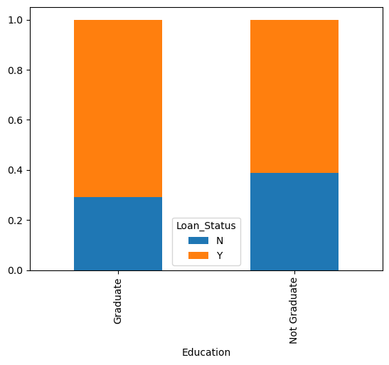
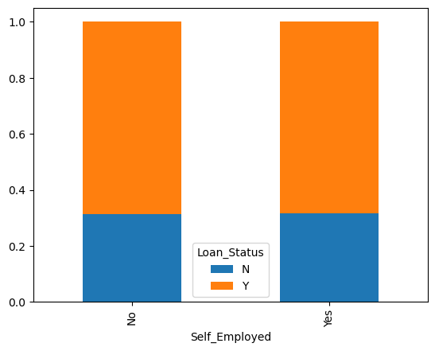

# Mini-project IV

### [Assignment](assignment.md)

## Project/Goals
To automate the loan eligibility process based on customer details. 

## Hypothesis
Loans are more likely to be granted to:
1. High-income applicants.
2. Applicants with a credit history.
3. Applicants with Higher Education 
4. Applicants in urban areas

Testing methods: Visualizations and use of Statsmodel Hypothesis Testing

## Process
### EDA
Created visualizations and ran statistical testing to confirm previous hypothesis, observe patterns, correlations and potential outliers.

### Cleaning
Replaced null values with 2 different strategies:

1. Default values to replace columns for 'Married', 'Dependents', 'Credit_History' (Not, 0 and 0) respectively.
2. Based on observations from EDA, replaced 'Self_Employment' with two values derived from aggregate grouping ApplicantIncome on Self_Employment.

### Feature Engineering:
- Identifying column types: 
    a. Changed `Property Area` and `Dependents` as Ordinal Categories. Changed the datatype accordingly.
    b. Changed `Married`, `Credit_History`, `Education` as Binary categories.
- `Income`: Summed `ApplicantIncome` and `Co-ApplicantIncome` and created new column Income. Performed log transformation on this column to normalize distribution. Observed that outlier data was also corrected by this transformation.
- `LoanAmount`: Also performed log transformation on Loan Amount to normalize data.

### Modeling
#### Baseline Model:

- `StandardScaler` on numerical columns (`LoanAmount`, etc).
- `MinMaxScaler` on ordinal categories. 
-  No dimension reduction techniques i.e. no `PCA()` or `SelectKBest()`
-  `LogisticRegression()` classifer set to default values
-  Results
**Accuracy** - 0.79
**Precision** - 0.73
**Recall** - 0.79

Then developed a Pipeline Model with GridSearchCV. The parameters list included:
- different Scalers to try on the features (`QuantileTransformer` and `RobustTransformer`), 
- dimension reduction by `PCA()` and `SelectKBest()`
- classifiers:`RidgeClassifier()`, `BernoulliNB()`, `SVC()`, `RandomForestClassifier()`, and again, `LogisticRegression().

## Results/Demo

The best test set accuracy: 0.9193548387096774

Achieved with hyperparameters: 

    - 'classifier': RandomForestClassifier()
    - 'features__pca__n_components': 0 
    - 'features__select_best__k': 3
    - 'preprocessing__categorical__scaling': StandardScaler
    - 'preprocessing__numeric__scaling': StandardScaler(),
    - 'preprocessing__numeric_log__scaling': StandardScaler()}

**SelectKBest top 3 features**: `['Credit_History', 'Education', 'Married']`

**Demo**:

http://ec2-3-145-177-87.us-east-2.compute.amazonaws.com:8000/predict

http://ec2-3-145-177-87.us-east-2.compute.amazonaws.com:8000/probility

## Challenges 
**AWS environment**:
- Smaller disk space, size limit. Needed to uninstall Anaconda and reinstall Miniconda to optimize disk space.
- Older versions of packages and libraries. Needed to upgrade.
- Working in several environments (Jupyter notebook, Terminal for Flask, Ubuntu AWS, Postman, Google Colab, etc)
- Learning curve with the entire project, working with a lot of new strategies like Pipelining 

## Future Goals
- Use XGBoost and more sophisticated classifiers.
- Add more functionality to the website.